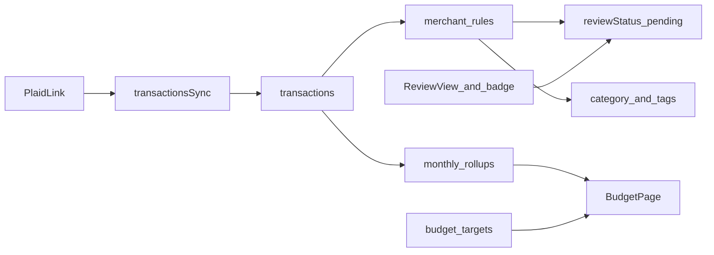
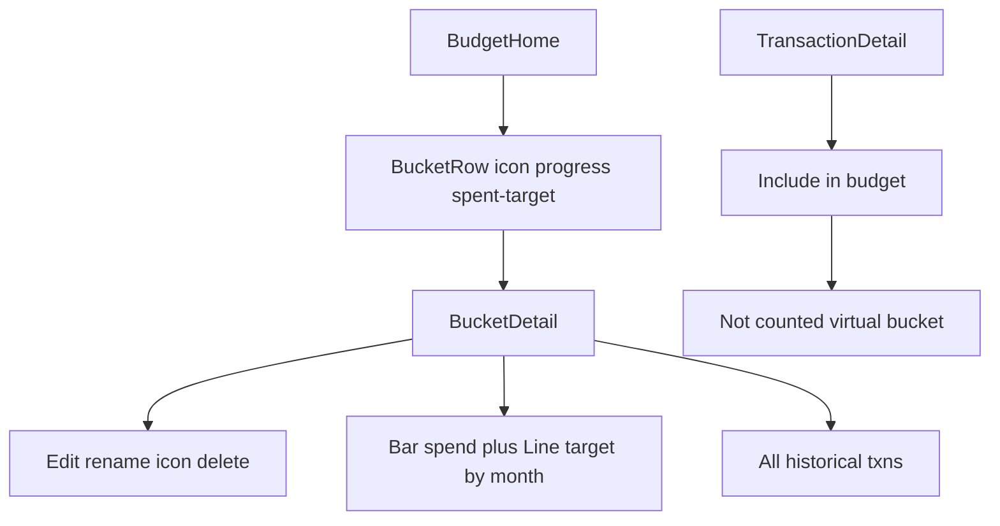

# Budgeting Feature Plan

## Current state

- [`app/budget/page.tsx`](app/budget/page.tsx) is a stub; [`TabBar`](components/layout/TabBar.tsx) already links to `/budget`.
- Plaid **Transactions** is required at link time ([`create-link-token/route.ts`](app/api/plaid/create-link-token/route.ts)), but transactions are only fetched ephemerally in [`lib/plaid-backfill.ts`](lib/plaid-backfill.ts) to reconstruct net worth—not stored.
- Schema ([`drizzle/schema.ts`](drizzle/schema.ts)) has `plaid_items`, `financial_accounts`, `balance_snapshots`—no transaction or budget tables.
- Account types already distinguish cash vs credit ([`lib/account-groups.ts`](lib/account-groups.ts): `depository` → Cash, `credit`/`loan` → Liabilities).

**Default product model:** User-facing **Buckets** (stored as `budget_categories`) with **icons**, monthly **targets**, and **progress** ($0 → target). Users **rename** and **delete** buckets (deleted → **Uncategorized**). Each transaction has **Include in budget** (default on); when off, it appears in a pinned **Not counted** bucket at the bottom and is excluded from totals. Plus tags, vendor rules, **Needs Review**, and bucket **detail** with full history + monthly spend chart (bars) with budget target (line). Investment accounts stay out of spend sync.

---

## Terminology: Buckets, tags, and virtual buckets

| Concept | UI name | Role | Budget math |
|---------|---------|------|-------------|
| **Bucket** | Bucket | User or system grouping (`budget_categories`); has **icon**, **label**, optional monthly **target** | Spend rolls up when `includeInBudget = true`, categorized, and reviewed |
| **Tag** | Tag | User labels; multiple per transaction | Filters/lists only in v1; does not drive bucket targets |
| **Uncategorized** | Uncategorized (system) | `userCategoryId` is null after delete or before assignment | Counted in budget totals if `includeInBudget` and not pending review |
| **Not counted** | Not counted (system, bottom of list) | `includeInBudget = false` | **Excluded** from all budget totals and progress bars |
| **Needs Review** | Review (system) | `reviewStatus = pending` | Excluded from spend totals until reviewed |

Users can **create**, **rename**, and **delete** custom buckets. System buckets cannot be deleted or renamed (labels fixed in UI copy).

### Include in budget (per transaction)

- DB column: `includeInBudget` boolean, **default `true`**.
- UI label: **“Include in budget”** (toggle on transaction detail and list row actions). Alternative considered: “Count toward budget”—**Include in budget** is clearer when off means “still visible, just not counted.”
- When **off**: transaction stays in its assigned bucket for browsing, but rollups treat it as **Not counted**; budget home also lists a **Not counted** virtual bucket (pinned last) aggregating all `includeInBudget = false` across categories.
- Distinct from **transfer** detection (`isTransfer`) and **income** categories—those remain automatic exclusions; `includeInBudget` is an explicit user override (reimbursements, one-offs, gifts).

### Bucket CRUD

| Action | Behavior |
|--------|----------|
| **Create** | New user bucket: name + icon picker; optional first-month target |
| **Rename** | `PATCH` label only; slug stable for user buckets or regenerate slug from label |
| **Delete** | Soft-delete or hard-delete user bucket; set all `userCategoryId` pointing at it → `null` (**Uncategorized**); targets for that bucket removed |
| **Icon** | `icon` column: Lucide icon name (match app icon set) stored on `budget_categories` |

Seed system buckets: Uncategorized, Income (if separate), Transfer (hidden from main list). **Not counted** and **Needs Review** are **virtual**—computed in API/UI, not rows users delete.

---

## Phase 1 — Transaction ledger and sync (foundation)

### Database (new migration)

Add to [`drizzle/schema.ts`](drizzle/schema.ts):

| Table | Purpose |
|-------|---------|
| `transactions` | One row per Plaid transaction |
| `budget_categories` | Buckets: `slug`, `label`, `icon` (Lucide name), `isSystem`, `isIncome`, `userId` (null = global seed), `sortOrder`, `deletedAt` optional |
| `budget_tags` | User-defined tags (`name`, optional `color`) |
| `transaction_tags` | Junction `(transaction_id, tag_id)` |
| `budget_targets` | `(user_id, category_id, month)` → target amount |
| `merchant_rules` | Per-user vendor behavior (see below) |

Extend `plaid_items`: `transactionsCursor`, `lastTransactionsSyncAt`.

**`transactions` (essential columns):** `userId`, `financialAccountId`, `plaidTransactionId`, `date`, `amount`, `name`, `merchantName`, `pending`, Plaid category fields (jsonb + primary/detailed), `userCategoryId`, `includeInBudget` (default true), `note` (text, nullable — **v1.5**), `isTransfer`, `reviewStatus`, `reviewedAt`, `duplicateOfTransactionId` (nullable — **v2**), `subscriptionGroupId` (Phase 3), timestamps.

**`financial_accounts` (extend):** `excludeFromBudget` boolean default false (**v1.5**) — hide from spend sync views and rollups; still in net worth.

**`budget_user_settings` (v1.5):** `userId`, `includePendingInBudget` (default false), `monthlyBudgetTotal` (optional override for left-to-spend), timestamps.

**`budget_categories` (extend v2):** `rolloverEnabled` boolean default false — unused target carries to next month.

**`transaction_splits` (v2):** `transactionId`, `categoryId`, `amount`, `sortOrder` — parent txn excluded from bucket rollups when splits exist; children sum to parent amount.

**`recurring_bills` (v2):** `userId`, `name`, `merchantKey`, `expectedAmount`, `cadence`, `nextDueDate`, `categoryId`, `isActive`.

**`saved_reports` (v2, optional):** `userId`, `name`, `filters` jsonb (date range, buckets, tags, merchants).

**`merchant_rules`:** `userId`, `merchantKey` (normalized merchant string), `displayName`, `defaultCategoryId` (nullable), `requiresReview` (boolean), `applyToFuture` (boolean, default true when user saves a rule), timestamps. Tag defaults via `merchant_rule_tags` junction or jsonb array of tag IDs.

Indexes: `(userId, date DESC)`, `(userId, reviewStatus, date)` where pending, unique `plaidTransactionId`.

Seed default categories from Plaid Personal Finance Categories. Seed optional system list of **review-suggested merchants** (Amazon, Target, Walmart, Costco, PayPal, etc.) as UI hints—not auto-rules until user confirms.

### Merchant normalization — [`lib/merchant-key.ts`](lib/merchant-key.ts) (new)

Single function to normalize `merchantName` / `name` → stable `merchantKey` (lowercase, strip suffixes like “#1234”, “AMZN MKTP”). Used by sync, rules, and retroactive apply.

### Sync service — [`lib/plaid-transactions.ts`](lib/plaid-transactions.ts) (new)

- **`transactionsSync`** per Item; upsert/remove; map to `financial_accounts`.
- On each **added/modified** transaction, after Plaid category mapping:
  1. Look up `merchant_rules` by `merchantKey`.
  2. If `requiresReview` → set `reviewStatus = 'pending'` (do not auto-set category unless rule also has `defaultCategoryId` and user opted into auto-apply—default for review vendors is **pending only**).
  3. If rule has `defaultCategoryId` / tags and not review-only → apply overrides on ingest.
  4. Else if merchant matches **system ambiguous retailer list** and no rule yet → `reviewStatus = 'pending'` (first-time nudge, not a hard rule until user saves one).

**Rollups:** Exclude from spend/progress when: `reviewStatus = 'pending'`, `includeInBudget = false`, `isTransfer`, or income category. Uncategorized with include on **does** count toward “spent” but appears under Uncategorized bucket.

### API routes (Phase 1)

| Route | Behavior |
|-------|----------|
| `POST /api/plaid/sync-transactions` | Full/incremental sync |
| `GET /api/transactions` | Filters: `month`, `categoryId`, `tagId`, `accountId`, `reviewStatus`, `search`, cursor |
| `PATCH /api/transactions/[id]` | Bucket, tags, `includeInBudget`, transfer flag, mark `reviewed` |
| `GET /api/budget/categories` | List buckets with icon, spent, target, progress for `?month=` |
| `POST /api/budget/categories` | Create bucket (label, icon) |
| `PATCH /api/budget/categories/[id]` | Rename, change icon, reorder |
| `DELETE /api/budget/categories/[id]` | Delete bucket → reassign txns to uncategorized |
| `GET /api/budget/categories/[id]/trends?months=12` | Monthly `{ month, spent, target }[]` for detail chart |
| `GET /api/budget/tags` | List user tags |
| `POST /api/budget/tags` | Create tag |
| `GET /api/budget/review-count` | Count `reviewStatus = pending` (for badge) |

---

## Phase 2 — Vendor rules, review workflow, and budget UI

### Save flow — category/tag override + vendor rule prompt

When user saves from **transaction detail** (or inline edit), show a confirmation step (sheet or modal):

1. **Category** picker + **Tags** multi-select (create tag inline).
2. **“Apply to vendor?”** (shown when `merchantKey` is known):
   - **Apply to future transactions** from this vendor (creates/updates `merchant_rules`, sets `applyToFuture`, applies `defaultCategoryId` + default tags).
   - **Apply retroactively** to past transactions from this vendor (same `merchantKey`, e.g. last 24 months, excluding already-reviewed with conflicting user intent—batch PATCH in background, return count updated).
3. **“Always require review for this vendor”** toggle → sets `requiresReview = true` on rule; future txns land in Review queue; retroactive does not clear past pending unless user bulk-reviews.

Implementation: [`lib/merchant-rules.ts`](lib/merchant-rules.ts) with `upsertMerchantRule()`, `applyRuleRetroactive()`, `applyRuleOnTransaction()`.

| Route | Behavior |
|-------|----------|
| `PUT /api/merchant-rules` | Upsert rule (category, tags, requiresReview, applyToFuture) |
| `POST /api/merchant-rules/apply-retroactive` | Body: `merchantKey`, `categoryId`, `tagIds`, optional date range → update matching txns |
| `POST /api/budget/review/bulk` | Mark many as reviewed, or “approve all with category X” |

### Review view and badging

**Needs Review** is a first-class surface—not buried in filters.

| UI element | Behavior |
|------------|----------|
| **TabBar badge** on Budget tab | Dot or count from `GET /api/budget/review-count` (cap display “9+”) |
| **Budget home banner** | “N transactions need review” → tap opens Review |
| **Review view** (`/budget/review` or segment on budget page) | Chronological list of `reviewStatus = pending`; swipe or tap → detail; quick actions: pick category, add tags, mark reviewed |
| **Passive awareness** | After each sync, refresh review count; optional browser notification API later (v1: in-app badge only) |

Pre-seed UX copy suggesting review for Amazon/Target/Walmart when user first sees those merchants (no rule until user confirms “Always review”).

### Aggregation and targets — [`lib/budget-rollups.ts`](lib/budget-rollups.ts)

- Month spend per **bucket** (eligible txns only per rollup rules above).
- 3-month average per bucket (for context on home row optional).
- **Virtual buckets** in summary: Uncategorized, Needs Review, **Not counted** (pinned last).
- `getBucketMonthlyTrends(categoryId, months)` → array for chart API.

| Route | Behavior |
|-------|----------|
| `GET /api/budget/summary?month=` | Totals, buckets with `spent`, `target`, `progress`, virtual bucket totals |
| `PUT /api/budget/targets` | Monthly target per bucket |

### Budget UI — [`app/budget/page.tsx`](app/budget/page.tsx)

`components/budget/`:

#### Budget home (month selected)

1. Month header: **left to spend** (v1.5), **savings rate** (v2), review banner/badge, pending toggle (v1.5).
2. **Bucket list** — each row:
   - **Icon** (from `budget_categories.icon`)
   - **Title** (bucket label)
   - **Progress bar**: fill = `spent / target` (cap at 100% visually; over-budget uses warning color)
   - **Amounts**: `$spent` · `$0–$target` (or “$spent of $target” on one line)
   - Tap row → **Bucket detail**
3. **Virtual rows** (same row component where applicable): Uncategorized, Needs Review; **Not counted** always **last**
4. All-transactions entry + filters; **Review** sub-view.

#### Bucket detail — [`/budget/bucket/[id]`](app/budget/bucket/[id]/page.tsx) or full-screen sheet

| Section | Content |
|---------|---------|
| **Header** | Icon + title; **Edit bucket** (rename, icon, delete with confirm: “Transactions move to Uncategorized”) |
| **This month** | Progress bar + `$spent of $target`; inline edit target for selected month |
| **Trend chart** | Recharts **bar chart**: X = last N months (default 12), bar height = spend in bucket; **line overlay** = `budget_targets` for that bucket each month (line can differ per month if user changed targets) |
| **Transactions** | Full **historical** list for bucket (paginated, date desc); not limited to selected month |
| **Empty states** | No txns; no target set (“Set a budget”) |

#### Transaction detail sheet

- Bucket picker, tags, **note** (v1.5), **Include in budget** toggle (default on), vendor rule prompt on save; **Split** entry point (v2).

Match portfolio patterns: full-screen sheets, [`NetWorthChart`](components/portfolio/NetWorthChart.tsx) / Recharts for bucket trend, [`lib/account-display.ts`](lib/account-display.ts) for amounts.

---

## Phase 3 — Subscriptions

### Subscription detection — [`lib/subscription-detection.ts`](lib/subscription-detection.ts)

Distinct from **review** and **recurring bills** (v2): subscriptions = detected recurring *charges*; bills = user-defined due dates and expected amounts.

- `subscription_groups` table; UI section on budget home with confirm/dismiss.
- Does not include bill negotiation or auto-cancel.

---

## Phase 3.5 (v1.5) — Power-user polish

Ship after Phase 2–3 core is usable. All items are **in scope** (not optional backlog).

### Transaction notes

- `transactions.note` (text, nullable); PATCH from detail sheet.
- Show note icon/snippet in transaction lists and review queue.

### Bulk categorize

- Multi-select mode on Review, Uncategorized, and all-transactions lists.
- `POST /api/transactions/bulk` body: `{ ids[], userCategoryId?, tagIds?, includeInBudget?, markReviewed? }`.
- Progress toast for large batches.

### Budget alerts (in-app)

- On rollup: per bucket, if `spent >= 0.8 * target` → warning state; `>= target` → over state.
- Budget home: badge/dot on bucket row; optional dismiss per bucket per month (`budget_alert_dismissals` or localStorage v1.5).
- No email/push in v1.5.

### Pending transactions toggle

- `budget_user_settings.includePendingInBudget` (default **false**).
- Settings or month header toggle: “Include pending.”
- Rollups and lists respect flag; pending rows visually distinct (dashed or “Pending” pill).

### Refund / credit handling

- Bucket spend = **net** of outflows and inflows in bucket (`sum(amount)` with Plaid sign convention documented in rollups).
- Progress bar can show net below zero as “$X credit” without breaking math.
- Refunds in same bucket reduce `spent` toward target.

### Hide account from budget

- `financial_accounts.excludeFromBudget`; toggle in account detail (portfolio modal) or budget settings.
- Sync still stores txns; rollups and budget lists filter them out.
- Net worth unchanged.

### Left to spend / safe-to-spend

- `GET /api/budget/summary` adds: `leftToSpend = totalTargets - totalSpent` (eligible txns only).
- Optional: subtract sum of **active recurring bills** due in selected month (v2 bills table can feed this; v1.5 uses targets only if bills not ready).
- Prominent on budget home month header.

| Route / lib | v1.5 addition |
|-------------|----------------|
| `PATCH /api/transactions/[id]` | `note` |
| `POST /api/transactions/bulk` | Bulk updates |
| `GET/PATCH /api/budget/settings` | Pending toggle, optional monthly total |
| `PATCH /api/accounts/[id]` | `excludeFromBudget` |
| [`lib/budget-rollups.ts`](lib/budget-rollups.ts) | Net refunds, pending filter, alert thresholds, leftToSpend |

---

## Phase 4 (v2) — Depth and FIRE insights

### Split transaction

- `transaction_splits` rows; parent marked `hasSplits`; rollups use split lines only.
- UI on detail sheet: “Split” → add lines (bucket + amount); must sum to parent `amount`.
- Excluded from v1.5 bulk apply unless “replace splits” explicit.

### Rollover unused bucket (opt-in per bucket)

- `budget_categories.rolloverEnabled` default **false**.
- Effective target for month M = `target(M) + max(0, target(M-1) - spent(M-1))` when enabled.
- Bucket detail chart line uses **effective** target; edit UI explains rollover.

### Recurring bills / calendar

- `recurring_bills` CRUD; user-created (not only detected).
- Budget section **Upcoming bills** or `/budget/bills`: list by `nextDueDate`, amount, bucket.
- Feeds **left to spend** when v2 ships (committed = bills due this month).
- Distinct from subscription detection (subscriptions = historical pattern; bills = user schedule).

### Cash flow chart

- `GET /api/budget/cash-flow?months=12` → `{ month, income, expense, net }[]`.
- Budget home or `/budget/insights`: Recharts grouped bars or area (income vs expense).
- Income from income buckets + negative Plaid amounts normalized.

### Savings rate widget

- Same API or summary field: `savingsRate = (income - expense) / income` for selected month (null if no income).
- Card on budget home; later link to Planner tab (v3+).

### Duplicate / transfer review

- [`lib/transaction-duplicates.ts`](lib/transaction-duplicates.ts): flag same `amount` + date ±1d + similar merchant, or transfer pairs.
- `GET /api/budget/duplicates` or include in review-adjacent UI.
- User actions: mark duplicate (link `duplicateOfTransactionId`), confirm transfer, dismiss.

### CSV export

- `GET /api/budget/export?from=&to=&format=csv` — transactions + optional monthly rollup by bucket.
- Settings or budget menu “Export”; rate-limit per user.

### Custom reports

- Filter builder UI: date range, buckets, tags, merchants, accounts, include/exclude pending.
- `GET /api/transactions` with full filter query params; optional `POST /api/budget/reports` save named `saved_reports`.
- Results table + export CSV from same filters.

| Route / lib | v2 addition |
|-------------|-------------|
| `POST/PATCH/DELETE /api/transactions/[id]/splits` | Split lines |
| `GET/PUT /api/budget/categories/[id]` | `rolloverEnabled` |
| `CRUD /api/budget/bills` | Recurring bills |
| `GET /api/budget/cash-flow` | Income vs expense series |
| `GET /api/budget/export` | CSV |
| `GET/POST /api/budget/reports` | Saved filters |
| `GET /api/budget/duplicates` | Duplicate candidates |

---

## Phase 5 — Future (v3+): receipt AI, Planner, deferred items

### Deferred (not v1 / v1.5 / v2)

| Feature | Notes |
|---------|--------|
| Tag-based rollups | Optional second breakdown |
| Demo seed transactions | Demo account |
| Email/push notifications | Review count, alerts |
| Planner ↔ budget link | FI goals vs actual spend |
| Couples / shared household | Large scope |
| Bill negotiation / cancel subs | Out of product scope |
| Credit score / Sankey | Low priority |
| Full YNAB envelope assignment | Different model |

### Retailer detail and AI matching

### Problem

Plaid only provides aggregate merchant strings (“Amazon”, “Target”)—not line items—so category accuracy for big-box retailers stays poor even with review.

### Possible directions

| Approach | Description |
|----------|-------------|
| **Retailer connections** | No broad public APIs for Amazon/Target/Walmart order history for individuals; would require partnerships, email receipt parsing (Gmail OAuth + structured emails), or manual import only |
| **Receipt / PDF / screenshot upload** | User uploads order confirmation or statement snippet; store `receipt_imports` + parsed line items |
| **AI matching** | LLM extracts {date, amount, description}; fuzzy-match to existing `transactions` by amount±tolerance + date + merchant; suggest category/tags per line; user confirms → writes overrides + optional merchant rules |
| **Order-level tags** | Matched lines inherit category/tags; unmatched lines flagged for review |

### Schema sketch (future)

- `receipt_imports`, `receipt_line_items`, `transaction_matches` (confidence score).
- New API: `POST /api/receipts/parse`, `POST /api/receipts/match-confirm`.

### UX hook

From a **pending Amazon transaction** in Review view: “Upload receipt to split” → future flow. v1: placeholder disabled or “Coming soon” with explanation.

---

## Account and security notes

- All routes: `requireUserId` / `requireWritableUser`; demo user read-only.
- Retroactive apply scoped by `userId` + `merchantKey`; never cross-user.
- No retailer credentials stored in v1.

---

## File touch summary

| Area | New / changed files |
|------|---------------------|
| Schema | `drizzle/schema.ts`, migration |
| Lib | `plaid-transactions.ts`, `merchant-key.ts`, `merchant-rules.ts`, `budget-rollups.ts`, `subscription-detection.ts`, `transaction-duplicates.ts` (v2) |
| API | `api/transactions/` (incl. bulk, splits), `api/budget/` (settings, cash-flow, export, reports, bills), `api/merchant-rules/`, `api/plaid/sync-transactions/` |
| UI | `components/budget/*`, `app/budget/bills`, `app/budget/insights` (v2), account `excludeFromBudget` in portfolio modal |
| Integrations | `exchange-token`, `sync-accounts`, Settings |

---

## Suggested build order

**v1 — Core**

1. Schema + sync
2. Bucket CRUD + transaction PATCH + tags + review count
3. Rollups + summary + bucket trends API
4. Budget home + bucket detail + transaction detail + vendor rules
5. Review view + TabBar badge
6. Subscriptions + integrate sync on link/settings

**v1.5 — Polish**

7. Notes + bulk categorize API/UI
8. Refunds in rollups + pending toggle + `budget_user_settings`
9. Hide account from budget (schema + portfolio/budget settings)
10. Budget alerts on bucket rows + left to spend on month header

**v2 — Depth**

11. Split transactions (schema + detail UI + rollup path)
12. Rollover per bucket (optional flag + effective target in rollups/charts)
13. Recurring bills CRUD + upcoming section + left-to-spend committed amount
14. Cash flow chart + savings rate widget
15. Duplicate detection UI + CSV export
16. Custom reports (filters + optional saved reports)

**v3+**

17. Receipt/AI matching + Planner-budget link (Phase 5)

---

## Risks and mitigations

| Risk | Mitigation |
|------|------------|
| Retroactive apply touches hundreds of rows | Background job + progress toast; limit default window (24 mo) |
| Review queue never emptied | Banner + badge; exclude pending from “spent” so totals stay honest |
| User confusion: bucket vs tag vs not counted | Buckets + Include in budget; tags secondary; Not counted pinned last |
| Deleting bucket with many txns | Confirm + batch null category; show count moved to Uncategorized |
| Chart with no historical targets | Line falls back to 0 or hide line for months without `budget_targets` row |
| Amazon still one blob | Review + future receipt/AI track |
| Plaid history limits | Initial sync on link; show “unreviewed historical” count |
